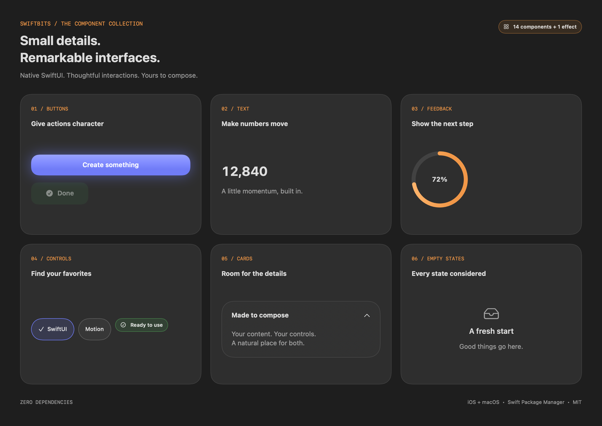

<div align="center">
  <br />

  <!-- TODO: Add your SwiftBits logo at Assets/README/swiftbits-logo.svg, then replace the heading below with:
  
  -->

  <h1>SwiftBits</h1>

  <strong>Expressive SwiftUI components, effects, and interaction patterns.</strong>
  <br />
  <sub>Built to help Swift developers add polish without rebuilding every animation from scratch.</sub>

  <br />
  <br />

  <a href="https://github.com/adamsaldev/swift-bits/stargazers"></a>
  <a href="https://github.com/adamsaldev/swift-bits/blob/main/LICENSE"></a>
  <a href="https://github.com/adamsaldev/swift-bits/actions/workflows/ci.yml"></a>
  

  <br />
  <br />

  <a href="#installation">Installation</a> ·
  <a href="#components">Components</a> ·
  <a href="#contributing">Contributing</a>
  <!-- TODO: Add a DocC or documentation-site link here when published. -->
</div>

<br />

<!-- TODO: Add a wide component showcase GIF or PNG at Assets/README/showcase.png, then uncomment:
<div align="center">
  
</div>

<br />
-->

## Built for SwiftUI

SwiftBits is a growing collection of reusable SwiftUI components that focus on motion, interaction, and visual polish. Every component is designed to feel native to SwiftUI: configurable through initializers, composable with view builders, and installable through Swift Package Manager.

Use the package as a source of production-ready building blocks, or study the implementation to learn how expressive SwiftUI interfaces are constructed.

## Highlights

- **Native SwiftUI APIs** — views, modifiers, bindings, and view builders instead of wrappers around another UI system
- **Focused dependencies** — currently built entirely with Apple frameworks
- **Customizable by default** — tune colors, timing, sizing, shapes, and behavior from the public API
- **Accessible foundations** — components are designed with Dynamic Type, reduced motion, and native interaction semantics in mind
- **Documented and tested** — public APIs include DocC documentation and the package includes automated tests
- **Swift Package Manager ready** — add the repository directly to an Xcode project

## Components

| Component | Category | Purpose | Status |
| --- | --- | --- | --- |
| `GlowButton` | Buttons | Configurable button with glow and pressed feedback | Available |
| `.shimmer()` | Effects | Animated light sweep for loading states | Available |
| `AnimatedCounter` | Text | Smooth transitions between numeric values | Planned |
| `GlassCard` | Cards | Composable material-backed content container | Planned |
| `SkeletonView` | Loading | Reusable placeholder layouts | Planned |
| `CollapsingHeader` | Scrolling | Shared header behavior across scrollable tabs | Planned |

<!-- TODO: Replace planned rows with links to their source files as each component ships. -->

## Installation

### Xcode

In Xcode, open **File → Add Package Dependencies** and enter:

```text
https://github.com/adamsaldev/swift-bits.git
```

Add the `SwiftBits` product to your app target, then import it where needed:

```swift
import SwiftBits
```

### Package.swift

```swift
dependencies: [
    .package(
        url: "https://github.com/adamsaldev/swift-bits.git",
        branch: "main"
    )
]
```

> SwiftBits is currently pre-release. Pin to a version instead of `main` after the first tagged release.

## Quick start

### GlowButton

```swift
import SwiftBits
import SwiftUI

struct ContentView: View {
    var body: some View {
        GlowButton("Continue", tint: .purple) {
            print("Tapped")
        }
        .padding()
    }
}
```

### Shimmer

```swift
RoundedRectangle(cornerRadius: 14)
    .fill(.gray.opacity(0.22))
    .frame(height: 80)
    .shimmer()
```

## Package structure

```text
SwiftBits/
├── Package.swift
├── Sources/SwiftBits/
│   ├── Components/       Reusable views grouped by category
│   ├── Modifiers/        Effects applied to existing views
│   ├── Utilities/        Shared animation and layout helpers
│   └── SwiftBits.docc/    API documentation
├── Tests/SwiftBitsTests/  Unit and behavior tests
└── .github/workflows/     Automated build and test checks
```

## 📋 Requirements

- iOS 17+
- macOS 14+
- Swift 6.0+
- Xcode 16+

## 🗺️ Roadmap

- Expand the first collection of animated components
- Build a visual catalog app with live customization controls
- Publish complete DocC documentation
- Add snapshot and accessibility coverage
- Tag the first semantic release

<!-- TODO: Link each roadmap item to a GitHub issue once the issue tracker is organized. -->

## 🤝 Contributing

Ideas, bug reports, and pull requests are welcome. Read [CONTRIBUTING.md](CONTRIBUTING.md) before submitting a change.

When proposing a component, include its intended use case, customization API, accessibility behavior, and a visual preview when possible.

## 👨‍💻 Maintainer

Created and maintained by [Adam Saleh](https://github.com/adamsaldev).

## 💡 Inspiration and credit

SwiftBits is inspired by the creativity and discoverability of projects such as [React Bits](https://github.com/DavidHDev/react-bits), while its components and APIs are implemented specifically for SwiftUI.

If a component is adapted from another open-source project or public example, its source and license should be credited alongside the implementation.

## 📄 License

SwiftBits is available under the [MIT License](LICENSE).
